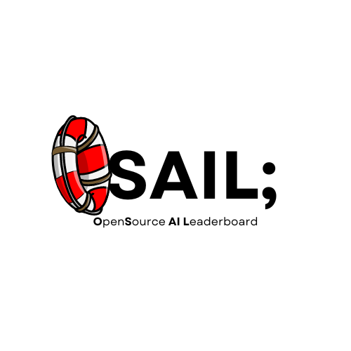

<p align="center">

</p>
<h1 align="center">A local leaderboard for evaluating your LLMs</h1>

<p align="center">
 


</p>

## Overview
OSAIL (OpenSource AI Leaderboard) is a service that allows you to evaluate LLMs by computing an [Elo](https://en.wikipedia.org/wiki/Elo_rating_system) rating for a set of given models. Osail uses a Judge LLM (which can be configured) to evaluate the candidate responses.

## Usage
### Installation
#### Binary
Go to the releases page to find the release that best suits your operating system and architecture. Once downloaded, launch it using:
```sh
./osail
```
Open up your browser and goto `localhost:8080` to see the starting page.

#### Build from source
clone the repository:
```sh
git clone https://github.com/softmaxer/osail.git
```
Make sure to have `go > 1.21` installed and then install [templ](https://templ.guide/):
```sh
go install github.com/a-h/templ/cmd/templ@latest
```
then,
```sh
make
```

### Starting an experiment
- Before starting an experiment, make sure to have [Ollama](https://www.ollama.com) installed on your PC as the judge model runs natively on your machine.
- The experiments and the ratings of the models are stored in an `SQLite` databse. So go ahead and create a new `my_database.db` file and include it in your `.env` file at the root. (Or use an existing file from anywhere in your system).
- System prompt defines the general behaviour of the LLM i.e., if it should respond in a certain format or with a certain tone, etc.
- The `PROMPT` file should be a `.txt` file that can contain multiple prompts separated by `----` (four dashes). **NOTE**: The field `system prompt` can be used a prompt template, and the `prompts` can be the actual text, as they will be concatenated for the inference.
- Choose a judge model that either exists on your PC locally, or one of the models available from [Ollama](https://www.ollama.com)
  **NOTE**: Since OSAIL uses Ollama as the main inference engine, any of the model tags present on their website should work out of the box! (given you have enough resources on your machine).

### Registering a Model
- Refer to the example `docker-compose.yml` file to see how to start up multiple ollama instances as docker images.
- Configure which port they should be running on, as per your will.
- Once you have filled out all the models that need to be running for the experiment, press run, and wait for it to finish.
  **NOTE**: This may take a very long time, depending on the resources available on your Machine. Ideally this should be run with a GPU

## Upcoming features and changes
- **Human In Loop (HIL)** Annotation
- Publishing an experiment / Sharing experiments
- UI changes

## Contributing
Any and all contributions are more than welcome for either upcoming features and/or bug fixes! To get started, clone the repository and make to sure to have `go > 1.21` and [templ](https://templ.guide/) installed. The app itself is built with Templating and server side rendering. Meaning the API is written to respond in HTML, with HTMX requests from the DOM elements. For any questions about the code / Bugs, please raise an Issue and wait for the maintainers to respond.
